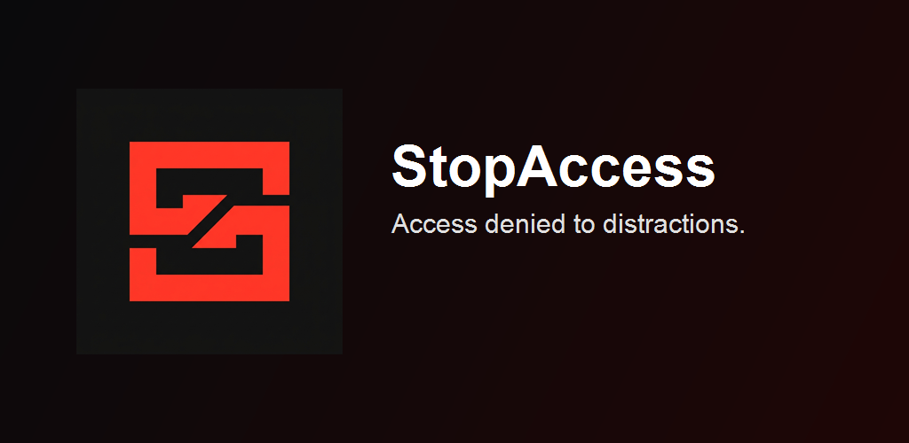

# StopAccess Extension

[](https://chromewebstore.google.com/detail/dajibamebijnlohkeddaignbneobpjag?utm_source=item-share-cb)

StopAccess is a precision site blocking and productivity extension. It combines rigorous browser website blocking via Declarative Net Request, local active tab tracking, strict schedules, Guardian PIN lockdowns, and optional NextDNS cloud synchronization.



## What It Does

| Feature | How it works |
| --- | --- |
| **Browser Website Blocking** | Tracks active tab time, blocks selected domains via fast Declarative Net Request rules, and displays strict "Access Denied" overlays. |
| **NextDNS Cloud Sync** | Synchronizes custom denylists, privacy blocklists, security settings, and profile-wide controls directly with the NextDNS API. |
| **Active Usage Tracking**| Accurately measures active tab duration on mapped domains to enforce precise daily usage limits entirely locally. |
| **Focus Sessions** | Starts timed sessions that immediately enforce temporary strict limitations on specific services. |
| **Strict Lock & Guardian PIN** | Designed defensively to protect settings; introduces a strict local PIN to stop impulsive bypasses during focus sessions. |

## Developer Setup

The codebase is organized as an NPM workspace containing the extension and its shared core packages:

- `extension/`: The core browser extension built with React and Tailwind CSS.
- `packages/`: Core domain routing, state, and NextDNS API logic.

### 1. Requirements

- Node.js 18+

### 2. Install Dependencies

From the repository root:
```bash
git clone <repository-url>
cd gate
npm install
```

### 3. Run Locally

Run the extension in watch mode to automatically rebuild assets during development:
```bash
npm run watch -w extension
```

*To load the extension:*
1. Navigate to `chrome://extensions/`
2. Enable **Developer mode** in the top right.
3. Select **Load unpacked** and locate the `gate/extension/` directory.

### 4. Verify Quality

Run TypeScript compilation, linting, and extension production build verification:
```bash
npm run verify:extension
```

## Privacy

StopAccess prioritizes localization constraint mapping. It processes active tabs via the Background Service Worker without passing context, strings, or analytics to any external endpoints.

## License

MIT
